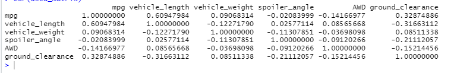
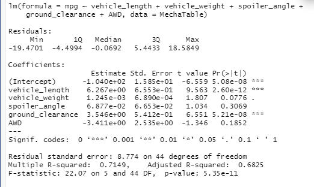
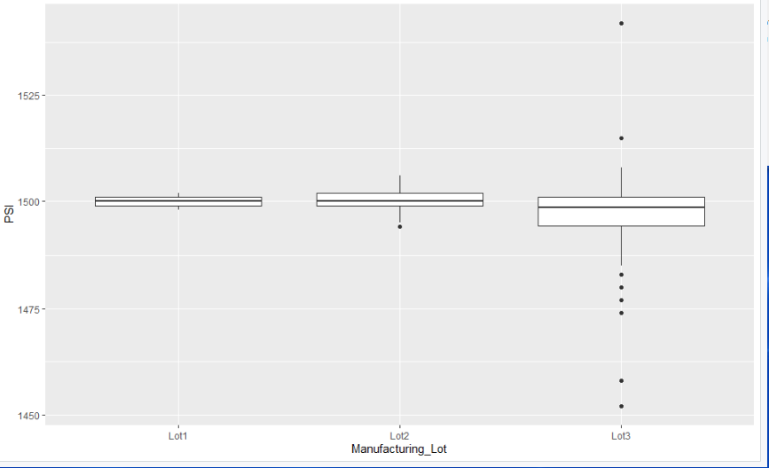
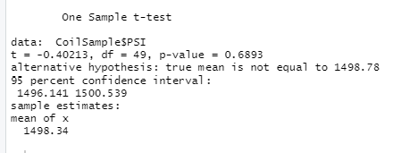
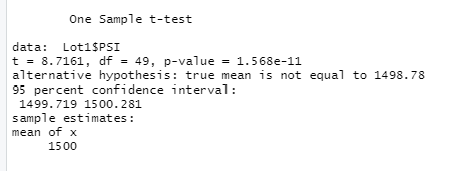
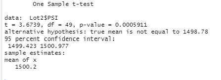
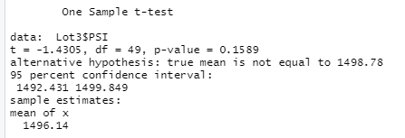

# MechaCar_Statistical_Analysis

## Overview/Purpose
In this challenge, we are helping Jeremy analyze and interpret data using R programming.  This data will be used to help his company (AutosRUs) make decisions about their services. 

### Linear Regression to Predict MPG
In this analysis, I was given a data set of 50 cars.  Each car had its height, weight, mpg, spoiler angle, ground clearance, and AWD information provided.  I put each variable into a correlation matrix to quickly determine if any correlation could be determines.  Here is the resulting matrix:

Each number in the matrix shows the amount of correlation between the variables in the rows and columns.  The mpg has a weak correlation with ground clearance (r value of 0.33) and a moderate correlation with the vehicle length (r value of .61).  These are the only two variables that provided a non-random amount of variance to the mpg values in the dataset.  When graphs are produced individually, you can see the slight and moderate correlation.  If we create a linear regression model for each of these variables individually, it will produce coefficients that can be used to create equations in slope-intercept form.  These equations have a slope of 4.67 for the vehicle length and 2.02 for the ground clearance.  When we combine this information with the r values, we can state that the slope will be non-zero.  Our confidence in that statement is much greater with the vehicle length because of the higher r value.  
Next, I did a multiple linear regression on the data.  It is presented here:

The summary of the data also shows a multiple R-squred value of .7149.  This tells us that there is a 71% that the increase/decrease in the mpg is due to the factors listed in the table.  According to the data the other 29% comes from factors/data that is not given in this data set.  Overall, the linear regression model is decently effective at predicting mpg in the car prototypes.  More information/variables will be needed to determine mpg with greater accuracy.

### Summary Statistics on Suspension Coils
The next data set that I needed to analyze gives information about the PSI of different coils that were manufactured in 3 different lots.  The goal of this anaylsis was to create a summary statistics table with mean, median, variance, and standard deviation for all of the data and for each lot individually.  After these tables are created, I need to use the information to make some decisions.  Here are both created tables:

The mean and median of the PSI is just about 1500 for all coils.  The variance is about 62.3 which is below the allowable 100 PSI required by the design specifications.

The mean and median of lots 1 and 2 are almost identical at 1500.  Lot 3 mean and median are a little bit lower and further apart.  It is also noticed that Lot 3 does not meet the design specifications of needing a variance under 100 PSI.  Lot 3 PSI is at 170.  This high variance probably causes the variance on the entire lot to increase as well.  The variance of 62 would go down greatly if lot 3 data was not included.  When I created a box and whisker plot of the three lots it shows a lot of outliers in the Lot 3 information.  Lots 1 and 2 have very small variability and few to no outliers, while lot 3 has a wide range of PSI data.  This would tell me that something needs to be fixed in Lot 3.

### T-Tests on Suspension Coils

The next section uses t test to determine the statistical significance of the differences in the PSI from one lot to the next.  The first test compared a random sample of the total population to the mean of the total population.  The next three tests all compare the different lots to the total population.  The results are shown below:

This test has a p-value of 0.6893.  A p-value that is this high indicates that there are some difference between a randomly selected sample and the original population and that those differences are more than likely not by chance.

This test has a p-value that is extremely low.  This indicates that there is very little statistical difference between the data points of lot 1 and the population mean.

This p-value is also low (p=.0005).  This is well below the usual statistical marker of p=.05.  It tells us that the data points here are not statistically different than the population mean.

This p-value is much higher (p=.1589).  This indicates that the values in lot 3 could be found to be statistically different than the total population mean.  This is consistent with all other test we have run on this data set.  It also shows that something may be wrong with lot 3 production.

## Study Design: MechaCar Competition

I am now tasked with creating a study to investigate my MechaCar compared to other cares in the competition.

### Description
I will be testing the highway fuel efficiency and the cost of each car at the competition.  I will look into the cost of building each car as well as how well it runs in a highway situation.

#### Null Hypothesis
The amount of money spent on a car has no effect on the highway fuel efficiency.

#### Alternative Hypothesis
If we spend more money building a car, that care will have increased fuel efficiency when driven on the highway.

#### Needed Data
In order to determine the correlation between cost and fuel efficiency, we will need two different set of information:
1. How much each car costs
2. How many miles per gallon the car performs at on the highway

#### Test
In order to determine if the hypothesis is true, I would run a linear regression model with the two variables.  I would look at the r squared value to determine the impact.  If the data comes in a larger format (similar to the one in section 1) I would also run a multiple regression analysis to determine if other factors may also be correlated.

